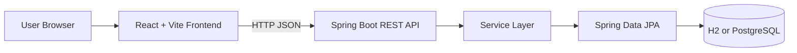
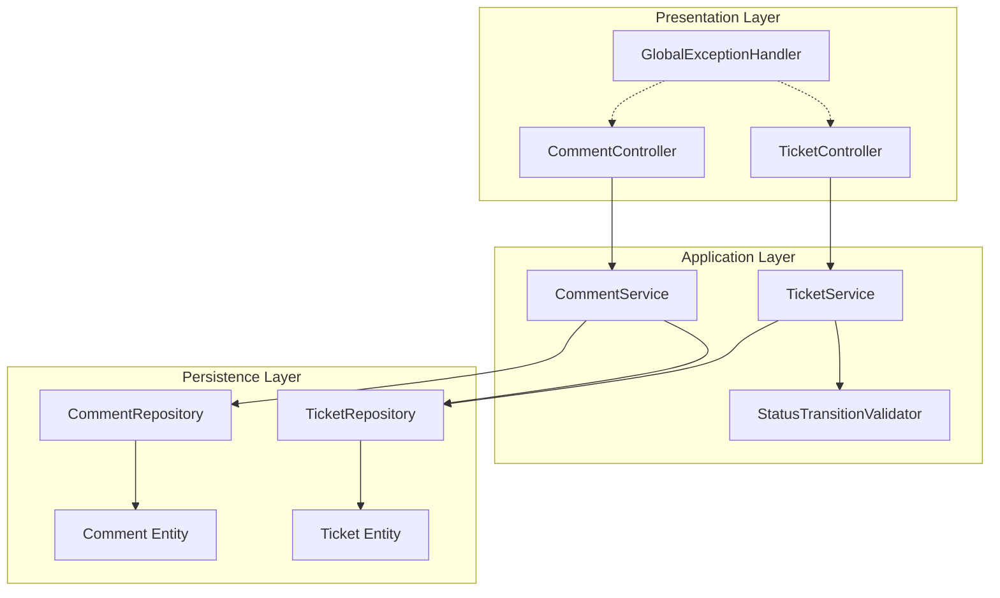
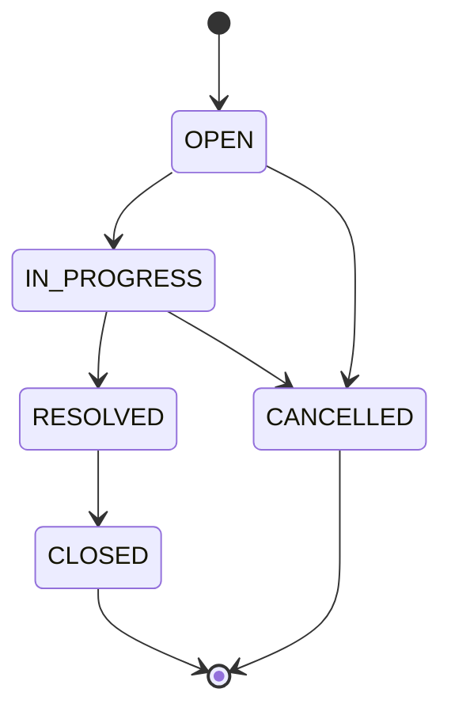
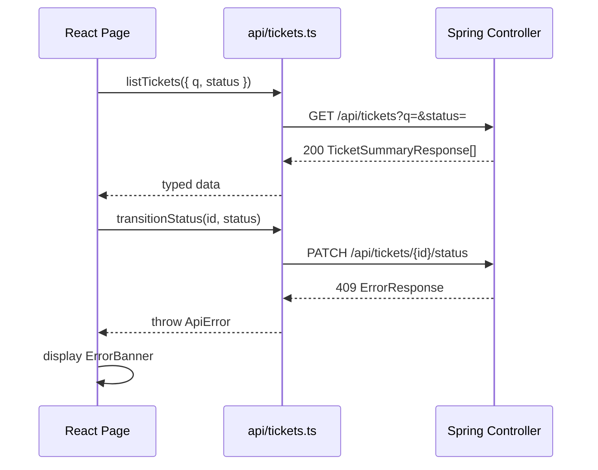

# Support Ticket Management System — Architecture

## 1. Purpose

This document defines the technical architecture for the Support Ticket Management System. It translates [requirements.md](./requirements.md) into a layered design that is simple, maintainable, and appropriate for a senior software engineer assignment.

**Design principles:**

- Thin controllers, rich services, dumb repositories
- API contracts decoupled from persistence via DTOs
- Business rules (especially status transitions) live in the service layer, not in controllers or entities
- One clear path for errors from backend to UI
- Zero committed secrets; environment-driven configuration for non-local databases

---

## 2. System Context



### 2.1 Runtime topology (local development)

| Component | Default port | Notes |
|-----------|--------------|-------|
| React/Vite dev server | `5173` | Serves UI; proxies or calls backend directly |
| Spring Boot API | `8080` | REST endpoints under `/api` |
| H2 (embedded) | in-process | Default profile; file or in-memory persistence |
| PostgreSQL | `5432` | Activated via `postgres` Spring profile |

The frontend communicates with the backend exclusively over HTTP/JSON. No direct database access from the UI.

---

## 3. Repository Layout

Monorepo with separate backend and frontend modules:

```
Support-Ticket-Management-System/
├── backend/                    # Spring Boot (Java 21)
│   └── src/main/java/.../
│       ├── config/             # CORS, Jackson, JPA auditing
│       ├── controller/         # REST controllers
│       ├── dto/                # Request/response records
│       ├── entity/             # JPA entities
│       ├── exception/          # Domain exceptions + @RestControllerAdvice
│       ├── repository/         # Spring Data JPA interfaces
│       ├── service/            # Business logic
│       └── util/               # Mappers, status state machine
├── frontend/                   # React + Vite
│   └── src/
│       ├── api/                # HTTP client + typed API functions
│       ├── components/         # Reusable UI components
│       ├── pages/              # Route-level views
│       └── types/              # TypeScript interfaces mirroring API DTOs
└── spec/                       # Requirements, architecture, API docs
```

---

## 4. Layered Backend Architecture



Each layer has a single direction of dependency: **Controller → Service → Repository → Entity**. DTOs cross the controller boundary only; entities never leave the service/repository layer.

---

## 5. Layer Responsibilities

### 5.1 Controller (`controller`)

**Purpose:** HTTP adapter. Maps requests to service calls and responses to HTTP status codes.

| Responsibility | Detail |
|----------------|--------|
| Route mapping | Expose REST endpoints under `/api` |
| Input binding | Deserialize JSON to request DTOs; bind query/path parameters |
| Declarative validation | Apply `@Valid` on request bodies; rely on global handler for failures |
| Response shaping | Map service results to response DTOs; set HTTP status (201, 200, etc.) |
| No business logic | No status rules, no search/filter logic, no entity mutation |

**Controllers:**

| Controller | Endpoints |
|------------|-----------|
| `TicketController` | `POST /api/tickets`, `GET /api/tickets`, `GET /api/tickets/{id}`, `PUT /api/tickets/{id}`, `PATCH /api/tickets/{id}/status` |
| `CommentController` | `POST /api/tickets/{id}/comments` (nested under ticket for REST clarity) |

**Does not:**

- Access repositories directly
- Catch and swallow exceptions (global handler owns error responses)
- Contain transaction annotations

---

### 5.2 Service (`service`)

**Purpose:** Application/business logic orchestration. Single entry point for all use cases.

| Responsibility | Detail |
|----------------|--------|
| Use-case orchestration | Create, read, update, search, filter, comment, status transition |
| Business rules | Enforce status state machine via `StatusTransitionValidator` |
| Entity ↔ DTO mapping | Convert between persistence model and API contracts |
| Not-found handling | Throw `TicketNotFoundException` when ticket id is missing |
| Timestamp management | Set `updatedAt` on ticket mutations; rely on JPA auditing for `createdAt` |
| Search semantics | Empty/whitespace `q` → return all tickets (AND with status filter if present) |

**Services:**

| Service | Methods (indicative) |
|---------|----------------------|
| `TicketService` | `create`, `findAll`, `findById`, `update`, `transitionStatus` |
| `CommentService` | `addComment` |

**Does not:**

- Know about HTTP status codes or request objects
- Build SQL or JPQL inline when a repository method suffices

---

### 5.3 Repository (`repository`)

**Purpose:** Data access abstraction via Spring Data JPA.

| Responsibility | Detail |
|----------------|--------|
| CRUD | `save`, `findById`, `existsById` for tickets and comments |
| Queries | Custom finder for search + filter (see §10) |
| Relationship loading | Fetch ticket with comments for detail view (`@EntityGraph` or `JOIN FETCH`) |

**Interfaces:**

| Repository | Key methods |
|------------|-------------|
| `TicketRepository` | `findAllByFilters(status, keyword)`, `findByIdWithComments(id)` |
| `CommentRepository` | `findByTicketIdOrderByCreatedAtAsc(ticketId)` (if not loaded via ticket) |

**Does not:**

- Contain business rules
- Return DTOs (returns entities only)

---

### 5.4 Entity (`entity`)

**Purpose:** JPA-mapped persistence model reflecting the database schema.

| Responsibility | Detail |
|----------------|--------|
| Table mapping | `@Entity`, `@Table`, column definitions, indexes |
| Relationships | `Ticket` one-to-many `Comment` with `@ManyToOne` back-reference |
| Enums | `Priority`, `TicketStatus` as `@Enumerated(STRING)` |
| Auditing | `@CreatedDate`, `@LastModifiedDate` via `@EntityListeners(AuditingEntityListener.class)` |
| Integrity | `@NotNull` on required columns; optional `assignee` nullable |

**Entities:**

| Entity | Notes |
|--------|-------|
| `Ticket` | Owns `status`; defaults to `OPEN` in service on create, not via unsafe entity default alone |
| `Comment` | FK to `Ticket`; cascade delete on ticket removal (if ticket delete is ever added) |

**Does not:**

- Expose REST serialization concerns (`@JsonIgnore` on bidirectional refs only where needed)
- Encode transition rules (no `ticket.transitionTo(...)` with embedded state machine — keep in service)

---

### 5.5 DTO (`dto`)

**Purpose:** Stable API contract independent of JPA entity shape and lazy-loading behavior.

**Request DTOs** (with Bean Validation annotations):

| DTO | Fields | Used by |
|-----|--------|---------|
| `CreateTicketRequest` | `title`, `description`, `priority`, `assignee?` | `POST /api/tickets` |
| `UpdateTicketRequest` | `title`, `description`, `priority`, `assignee?` | `PUT /api/tickets/{id}` |
| `TransitionStatusRequest` | `status` (target) | `PATCH /api/tickets/{id}/status` |
| `CreateCommentRequest` | `body`, `author` | `POST /api/tickets/{id}/comments` |

**Response DTOs:**

| DTO | Fields | Used by |
|-----|--------|---------|
| `TicketSummaryResponse` | `id`, `title`, `priority`, `status`, `assignee`, `createdAt`, `updatedAt` | List/search |
| `TicketDetailResponse` | Summary fields + `description` + `comments[]` | Detail |
| `CommentResponse` | `id`, `body`, `author`, `createdAt` | Nested in detail; returned on create |
| `ErrorResponse` | `timestamp`, `status`, `error`, `message`, `path`, `fieldErrors[]` | All error responses |

**Validation constraints (committed in DTOs):**

| Field | Constraints |
|-------|-------------|
| `title` | `@NotBlank`, `@Size(max = 200)` |
| `description` | `@NotBlank`, `@Size(max = 5000)` |
| `priority` | `@NotNull`, valid enum |
| `assignee` | `@Size(max = 100)` when present |
| `body` | `@NotBlank`, `@Size(max = 5000)` |
| `author` | `@NotBlank`, `@Size(max = 100)` |
| `status` (transition) | `@NotNull`, valid enum |

**Does not:**

- Leak JPA annotations or lazy collections
- Allow clients to set `id`, `createdAt`, or initial `status` on create

---

## 6. Global Exception Handling

A single `@RestControllerAdvice` class (`GlobalExceptionHandler`) centralizes all API error responses into the `ErrorResponse` DTO.

```mermaid
flowchart TD
    REQ[Incoming Request]
    CTRL[Controller]
    SVC[Service]
    GEH[GlobalExceptionHandler]
    RES[JSON ErrorResponse]

    REQ --> CTRL
    CTRL --> SVC
    SVC -->|throws| GEH
    CTRL -->|@Valid fails| GEH
    GEH --> RES
```

| Exception / trigger | HTTP status | Response |
|---------------------|-------------|----------|
| `MethodArgumentNotValidException` | 400 | `fieldErrors` per field (`title`, `priority`, …) |
| `HttpMessageNotReadableException` (malformed JSON) | 400 | General message |
| `MethodArgumentTypeMismatchException` (bad path/query enum) | 400 | General message |
| `TicketNotFoundException` | 404 | Ticket id in message |
| `InvalidStatusTransitionException` | 409 | Current and requested status in message |
| `IllegalArgumentException` (invalid filter enum, etc.) | 400 | Descriptive message |
| Unhandled `Exception` | 500 | Generic message; no stack trace in body |

**Logging:** Log 4xx at WARN with concise context; log 5xx at ERROR with stack trace server-side only.

**Frontend contract:** The React app reads `message` for banners and `fieldErrors` for inline form errors (see requirements AC-10.x).

---

## 7. Transaction Boundaries

Transactions are declared at the **service layer** using `@Transactional`.

| Operation | Transaction | Read-only | Rationale |
|-----------|-------------|-----------|-----------|
| `create` | read-write | no | Single insert |
| `findAll` / `findById` | read-write* | **yes** | Optimize read paths; avoid dirty checks |
| `update` | read-write | no | Load + mutate + save |
| `transitionStatus` | read-write | no | Load + validate + save atomically |
| `addComment` | read-write | no | Verify ticket exists + insert comment |

\*Use `@Transactional(readOnly = true)` on query methods.

**Rules:**

- Controllers are never `@Transactional`
- Repositories inherit the surrounding service transaction
- Status validation and persistence occur in the **same** transaction so a rejected transition never partially commits
- No programmatic transaction API unless a future use case requires it

---

## 8. Status State Machine

Status rules from requirements §4 are enforced in the **service layer** by a dedicated, stateless component.

### 8.1 Design



**Component:** `StatusTransitionValidator` (plain Java class or enum-backed map)

```text
Map<TicketStatus, Set<TicketStatus>> ALLOWED_TRANSITIONS
```

| From | Allowed targets |
|------|-----------------|
| `OPEN` | `IN_PROGRESS`, `CANCELLED` |
| `IN_PROGRESS` | `RESOLVED`, `CANCELLED` |
| `RESOLVED` | `CLOSED` |
| `CLOSED` | *(none)* |
| `CANCELLED` | *(none)* |

### 8.2 Enforcement flow

1. Client calls `PATCH /api/tickets/{id}/status` with `TransitionStatusRequest { status }`.
2. Controller validates DTO (`@Valid`).
3. `TicketService.transitionStatus(id, targetStatus)`:
   - Loads ticket (or throws 404).
   - Calls `StatusTransitionValidator.validate(current, target)`.
   - On failure → throws `InvalidStatusTransitionException` → HTTP 409.
   - On success → sets status, updates `updatedAt`, saves.
4. Status is **not** accepted on `CreateTicketRequest` or `UpdateTicketRequest` — only the dedicated status endpoint can change it. This prevents bypassing the state machine.

### 8.3 UI support

The detail response includes current `status`. The frontend renders only **legal next statuses** by mirroring the same transition table client-side for button visibility; the backend remains authoritative and rejects invalid attempts.

---

## 9. Search and Filter

Handled in `TicketService.findAll(status, q)` delegating to `TicketRepository`.

| Parameter | Behavior |
|-----------|----------|
| `status` | Optional; when present, filter `WHERE status = :status` |
| `q` | Optional; when non-blank, case-insensitive match on `title` OR `description` |
| Both | Logical **AND** |
| `q` blank/whitespace only | Treated as absent → no text filter (returns all, subject to status filter) |

**Implementation options** (pick one during implementation):

- Spring Data JPA `@Query` with `LOWER(title) LIKE %:q%` — portable across H2 and PostgreSQL
- `JpaSpecification` — more verbose but composable

Invalid `status` query value → 400 via type conversion or explicit validation in service.

---

## 10. Database Configuration

### 10.1 H2 (default profile)

Active when no profile is set, or explicitly `default`.

| Property | Value | Notes |
|----------|-------|-------|
| `spring.datasource.url` | `jdbc:h2:file:./data/ticketdb` | File-backed; survives restarts |
| `spring.datasource.driver-class-name` | `org.h2.Driver` | |
| `spring.jpa.hibernate.ddl-auto` | `update` | Schema evolves with entities in dev |
| `spring.h2.console.enabled` | `true` | Optional dev convenience |
| `spring.h2.console.path` | `/h2-console` | Not exposed in production profile |

H2 dependency is included by default. No environment variables required to start locally.

### 10.2 PostgreSQL (`postgres` profile)

Activated with `SPRING_PROFILES_ACTIVE=postgres`. **All connection settings come from environment variables only** — no passwords or hosts in committed YAML.

| Environment variable | Maps to | Example |
|----------------------|---------|---------|
| `DB_HOST` | `spring.datasource.url` host | `localhost` |
| `DB_PORT` | `spring.datasource.url` port | `5432` |
| `DB_NAME` | database name | `ticketdb` |
| `DB_USER` | `spring.datasource.username` | `ticket_user` |
| `DB_PASSWORD` | `spring.datasource.password` | *(set locally, never committed)* |

**`application-postgres.yml`** (committed) references placeholders:

```yaml
spring:
  datasource:
    url: jdbc:postgresql://${DB_HOST}:${DB_PORT}/${DB_NAME}
    username: ${DB_USER}
    password: ${DB_PASSWORD}
    driver-class-name: org.postgresql.Driver
  jpa:
    hibernate:
      ddl-auto: validate   # prefer Flyway/Liquibase for prod; validate is acceptable for assignment
    properties:
      hibernate:
        dialect: org.hibernate.dialect.PostgreSQLDialect
```

If any required env var is missing, the application fails fast at startup with a clear Spring binding error.

### 10.3 Schema parity

Entities and repositories must behave identically on H2 and PostgreSQL. Avoid database-specific SQL where possible; use portable JPQL and `LOWER()` for search.

---

## 11. CORS (Local Development)

Cross-origin requests arise because Vite (`http://localhost:5173`) calls Spring Boot (`http://localhost:8080`).

**Approach:** Spring `WebMvcConfigurer` CORS configuration in a `CorsConfig` class, active for `default` and `postgres` profiles.

| Setting | Value |
|---------|-------|
| Allowed origins | `http://localhost:5173` (configurable via `CORS_ALLOWED_ORIGINS` env var, defaulting to Vite dev URL) |
| Allowed methods | `GET`, `POST`, `PUT`, `PATCH`, `OPTIONS` |
| Allowed headers | `Content-Type`, `Accept` |
| Allow credentials | `false` (no cookies/auth in scope) |
| Max age | `3600` |

**Frontend alternative:** Vite `server.proxy` forwarding `/api` to `http://localhost:8080` avoids CORS entirely in dev. Either proxy **or** explicit CORS is acceptable; the backend CORS config is included so both modes work.

**Production note:** Replace localhost origin with the deployed frontend URL via environment variable. Do not use `*` with credentials.

---

## 12. Frontend Architecture (React + Vite)

### 12.1 Structure

| Area | Responsibility |
|------|----------------|
| `api/client.ts` | Base `fetch` wrapper; parses JSON; throws typed `ApiError` from `ErrorResponse` |
| `api/tickets.ts` | Functions per endpoint (`createTicket`, `listTickets`, …) |
| `types/` | TypeScript interfaces matching backend DTOs |
| `pages/TicketListPage` | List, search input, status filter dropdown |
| `pages/TicketDetailPage` | Detail view, edit form, status actions, comment form |
| `pages/CreateTicketPage` | Create form |
| `components/` | `TicketForm`, `CommentList`, `ErrorBanner`, `FieldError`, `StatusBadge` |

### 12.2 Data flow



### 12.3 Error display

- **400 + fieldErrors:** Map to inline field messages; preserve form state.
- **404:** Show "Ticket not found" on detail page.
- **409:** Show transition error on status action.
- **5xx / network:** Generic "Something went wrong" banner.

### 12.4 Configuration

`VITE_API_BASE_URL` defaults to `http://localhost:8080/api`. No secrets in frontend env files committed to the repo.

---

## 13. API Summary

| Method | Path | Request body | Response | Success |
|--------|------|--------------|----------|---------|
| `POST` | `/api/tickets` | `CreateTicketRequest` | `TicketDetailResponse` | 201 |
| `GET` | `/api/tickets` | — | `TicketSummaryResponse[]` | 200 |
| `GET` | `/api/tickets/{id}` | — | `TicketDetailResponse` | 200 |
| `PUT` | `/api/tickets/{id}` | `UpdateTicketRequest` | `TicketDetailResponse` | 200 |
| `PATCH` | `/api/tickets/{id}/status` | `TransitionStatusRequest` | `TicketDetailResponse` | 200 |
| `POST` | `/api/tickets/{id}/comments` | `CreateCommentRequest` | `CommentResponse` | 201 |

**List query parameters:** `q` (optional string), `status` (optional enum).

---

## 14. Cross-Cutting Concerns

| Concern | Approach |
|---------|----------|
| Validation | Jakarta Bean Validation on DTOs; enum type safety |
| Mapping | Static mapper class or manual mapping in service (no heavy mapping framework required) |
| IDs | `Long` surrogate keys; exposed in API as numbers |
| Time | `Instant` in entities/DTOs; ISO-8601 in JSON |
| Logging | SLF4J; structured context (ticket id) in service layer |
| Testing | Unit tests for `StatusTransitionValidator` and services; `@WebMvcTest` for controllers; Testcontainers optional for PostgreSQL integration |
| Security | Out of scope per requirements; no auth middleware |

---

## 15. Design Decisions Log

| Decision | Choice | Rationale |
|----------|--------|-----------|
| Status change endpoint | Dedicated `PATCH .../status` | Prevents status bypass via general update |
| Empty search `q` | Return all tickets | Better UX; documented in §9 |
| Invalid transition HTTP code | 409 Conflict | Distinguishes business rule violation from validation error |
| H2 persistence | File-based `./data/ticketdb` | Satisfies AC-8.1 without external DB |
| PostgreSQL config | Env vars only | Satisfies NFR-7; no committed secrets |
| State machine location | Service + validator class | Testable, single responsibility, not in entity |
| DTO vs entity exposure | Strict separation | Avoids lazy-load issues and API coupling |

---

## 16. Document History

| Version | Date | Changes |
|---------|------|---------|
| 1.0 | 2026-09-11 | Initial architecture |
