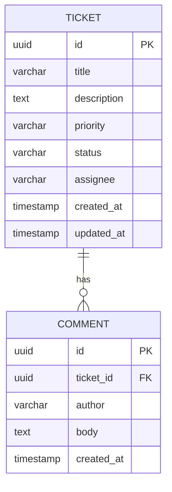

# Support Ticket Management System — Data Model

## 1. Purpose

This document defines the persistent data model for tickets and comments. It is the canonical source for field types, constraints, relationships, and database mapping rules.

**Related specifications:**

- [requirements.md](./requirements.md) — functional requirements
- [architecture.md](./architecture.md) — layer design and persistence approach
- [api-contract.md](./api-contract.md) — JSON representation of this model
- [state-machine.md](./state-machine.md) — `status` transition rules

---

## 2. Design Conventions

| Convention | Value |
|------------|-------|
| Primary keys | `UUID`, server-generated (`UUID.randomUUID()` or DB equivalent) |
| Timestamps | `Instant` (UTC), ISO-8601 in API JSON |
| Enums | Stored as `VARCHAR` (`STRING` enumeration in JPA) |
| String trimming | Leading/trailing whitespace trimmed on persist for all string fields |
| Optional fields | `NULL` in database when absent |
| ID format in API | UUID string, e.g. `"3fa85f64-5717-4562-b3fc-2c963f66afa6"` |

---

## 3. Entity Relationship



**Cardinality:** One ticket has zero or many comments. Each comment belongs to exactly one ticket.

**Referential integrity:** `comment.ticket_id` references `ticket.id`. On ticket deletion (out of scope for v1), comments would cascade-delete.

---

## 4. Ticket

### 4.1 Table: `ticket`

| Column | SQL type (indicative) | Nullable | Description |
|--------|----------------------|----------|-------------|
| `id` | `UUID` | NO | Primary key |
| `title` | `VARCHAR(120)` | NO | Short summary |
| `description` | `TEXT` / `VARCHAR(5000)` | NO | Full issue description |
| `priority` | `VARCHAR(20)` | NO | `LOW`, `MEDIUM`, `HIGH`, `CRITICAL` |
| `status` | `VARCHAR(20)` | NO | Lifecycle state; default `OPEN` on insert |
| `assignee` | `VARCHAR(120)` | YES | Optional assignee name or identifier |
| `created_at` | `TIMESTAMP WITH TIME ZONE` | NO | Set once on creation |
| `updated_at` | `TIMESTAMP WITH TIME ZONE` | NO | Set on creation; refreshed on every ticket update and status transition |

### 4.2 Field constraints

| Field | Required | Min length | Max length | Allowed values | Notes |
|-------|----------|------------|------------|----------------|-------|
| `id` | auto | — | — | UUID | Not client-supplied |
| `title` | yes | 3 | 120 | any non-blank text | After trim |
| `description` | yes | 5 | 5000 | any non-blank text | After trim |
| `priority` | yes | — | — | `LOW`, `MEDIUM`, `HIGH`, `CRITICAL` | |
| `status` | auto | — | — | `OPEN`, `IN_PROGRESS`, `RESOLVED`, `CLOSED`, `CANCELLED` | Set to `OPEN` on create; changed only via status endpoint |
| `assignee` | no | — | 120 | any text | `NULL` when omitted or blank after trim |
| `createdAt` | auto | — | — | ISO-8601 instant | Immutable after insert |
| `updatedAt` | auto | — | — | ISO-8601 instant | Updated on PATCH ticket and PATCH status |

### 4.3 Indexes (recommended)

| Index | Columns | Purpose |
|-------|---------|---------|
| `idx_ticket_status` | `status` | Status filter queries |
| `idx_ticket_created_at` | `created_at DESC` | Default list ordering |
| `idx_ticket_title_lower` | functional / app-level | Optional; search uses `LOWER(title)` |

### 4.4 JPA mapping notes

- Entity class: `Ticket`
- Table name: `ticket`
- `@OneToMany(mappedBy = "ticket", cascade = CascadeType.ALL, orphanRemoval = true)` to `Comment`
- `@Enumerated(EnumType.STRING)` for `priority` and `status`
- `@CreatedDate` on `createdAt`, `@LastModifiedDate` on `updatedAt` with JPA auditing enabled

---

## 5. Comment

### 5.1 Table: `comment`

| Column | SQL type (indicative) | Nullable | Description |
|--------|----------------------|----------|-------------|
| `id` | `UUID` | NO | Primary key |
| `ticket_id` | `UUID` | NO | Foreign key → `ticket.id` |
| `author` | `VARCHAR(120)` | NO | Comment author display name |
| `body` | `TEXT` / `VARCHAR(2000)` | NO | Comment text |
| `created_at` | `TIMESTAMP WITH TIME ZONE` | NO | Set once on creation |

### 5.2 Field constraints

| Field | Required | Min length | Max length | Notes |
|-------|----------|------------|------------|-------|
| `id` | auto | — | — | UUID; not client-supplied |
| `ticketId` | yes | — | — | Must reference an existing ticket |
| `author` | yes | 1 | 120 | After trim |
| `body` | yes | 1 | 2000 | After trim |
| `createdAt` | auto | — | — | Immutable after insert |

### 5.3 Indexes (recommended)

| Index | Columns | Purpose |
|-------|---------|---------|
| `idx_comment_ticket_id` | `ticket_id` | Load comments by ticket |
| `idx_comment_created_at` | `ticket_id`, `created_at ASC` | Ordered comment list |

### 5.4 JPA mapping notes

- Entity class: `Comment`
- Table name: `comment`
- `@ManyToOne(fetch = FetchType.LAZY) @JoinColumn(name = "ticket_id", nullable = false)` to `Ticket`
- `ticketId` exposed in API DTOs; in entity, use `@JoinColumn` / relationship

---

## 6. Enumerations

### 6.1 Priority

```
LOW | MEDIUM | HIGH | CRITICAL
```

### 6.2 TicketStatus

```
OPEN | IN_PROGRESS | RESOLVED | CLOSED | CANCELLED
```

Initial value on ticket creation: **`OPEN`**.

Status transitions: see [state-machine.md](./state-machine.md).

---

## 7. Validation Ownership

| Layer | Responsibility |
|-------|----------------|
| API DTOs | Enforce min/max length and required fields (mirrors §4.2 and §5.2) |
| Service | Reject unknown ticket on comment create; enforce status machine |
| Database | `NOT NULL`, FK constraints, column length limits |

Validation failures at the API boundary return **HTTP 400** with structured field errors (see [api-contract.md](./api-contract.md)).

---

## 8. Default Ordering

| Query | Default sort |
|-------|--------------|
| Ticket list | `updated_at DESC` (most recently updated first) |
| Comments on ticket | `created_at ASC` (oldest first) |

---

## 9. Sample Records

### Ticket

```json
{
  "id": "3fa85f64-5717-4562-b3fc-2c963f66afa6",
  "title": "Cannot reset password",
  "description": "User reports password reset email never arrives after three attempts.",
  "priority": "HIGH",
  "status": "OPEN",
  "assignee": "jane.smith",
  "createdAt": "2026-09-11T10:00:00Z",
  "updatedAt": "2026-09-11T10:00:00Z"
}
```

### Comment

```json
{
  "id": "7c9e6679-7425-40de-944b-e07fc1f90ae7",
  "ticketId": "3fa85f64-5717-4562-b3fc-2c963f66afa6",
  "author": "support.agent",
  "body": "Verified SMTP logs; retrying delivery.",
  "createdAt": "2026-09-11T11:30:00Z"
}
```

---

## 10. Document History

| Version | Date | Changes |
|---------|------|---------|
| 1.0 | 2026-09-11 | Initial data model |
