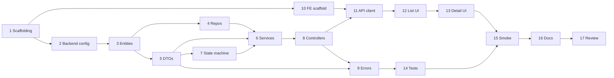

# Support Ticket Management System — Implementation Plan

## 1. Purpose

This document is the sequential implementation plan for the Support Ticket Management System. It translates the specifications under `spec/` into small, reviewable tasks suitable for incremental delivery.

**Authoritative specifications:**

| Document | Governs |
|----------|---------|
| [requirements.md](./requirements.md) | Functional & non-functional requirements |
| [architecture.md](./architecture.md) | Layered design, config, CORS |
| [data-model.md](./data-model.md) | Entities, UUID keys, field constraints |
| [api-contract.md](./api-contract.md) | REST endpoints, JSON shapes, status codes |
| [state-machine.md](./state-machine.md) | Status transitions, HTTP 409 rules |
| [ui-flow.md](./ui-flow.md) | Routes, screens, UX behavior |
| [test-strategy.md](./test-strategy.md) | Test pyramid, cases, smoke checklist |

**Conventions used in this plan:**

- Backend base package: `com.support.tickets`
- Backend root: `backend/`
- Frontend root: `frontend/`
- Tasks are **sequential** — do not start a task until its dependencies are complete

---

## 2. Task Overview

| # | Task | Depends on |
|---|------|------------|
| 1 | Project scaffolding | — |
| 2 | Backend dependencies/configuration | 1 |
| 3 | Domain enums/entities | 2 |
| 4 | Repositories | 3 |
| 5 | DTOs and validation | 3 |
| 6 | Service layer | 4, 5 |
| 7 | Explicit ticket state machine | 5 |
| 8 | REST controllers | 6, 7 |
| 9 | Global error handling | 5, 8 |
| 10 | Frontend scaffolding | 1 |
| 11 | API service | 10, 8 |
| 12 | Ticket list/search/filter UI | 11 |
| 13 | Ticket detail/comments/edit/status UI | 11, 12 |
| 14 | Backend tests | 9 |
| 15 | Frontend smoke verification | 13, 14 |
| 16 | Documentation | 15 |
| 17 | Final review and fixes | 16 |



---

## Task 1 — Project scaffolding

### Objective

Create the monorepo directory structure for backend and frontend with build tooling, git ignore rules, and placeholder entry points. No business logic yet.

### Files to create/change

| Path | Action |
|------|--------|
| `backend/pom.xml` | Create — Spring Boot parent, Java 21, packaging |
| `backend/src/main/java/com/support/tickets/TicketApplication.java` | Create — `@SpringBootApplication` main class |
| `backend/src/main/resources/application.yml` | Create — minimal placeholder |
| `backend/src/test/java/com/support/tickets/TicketApplicationTests.java` | Create — context-load smoke test |
| `backend/.gitignore` | Create — `target/`, `data/`, IDE files |
| `frontend/package.json` | Create — React, Vite, TypeScript, react-router-dom |
| `frontend/vite.config.ts` | Create — dev server port 5173, optional `/api` proxy |
| `frontend/tsconfig.json` | Create |
| `frontend/tsconfig.node.json` | Create |
| `frontend/index.html` | Create |
| `frontend/src/main.tsx` | Create — React root mount |
| `frontend/src/App.tsx` | Create — placeholder "Hello" |
| `frontend/.gitignore` | Create — `node_modules/`, `dist/` |
| `.gitignore` | Create/update — root ignores (`data/`, `.env`, IDE) |
| `README.md` | Create — brief project overview + link to `spec/` |

### Dependencies

None (first task).

### Acceptance criteria

- [ ] `backend/` is a valid Maven project targeting Java 21
- [ ] `frontend/` is a valid Vite + React + TypeScript project
- [ ] Directory layout matches [architecture.md](./architecture.md) §3
- [ ] No secrets or credentials in committed files
- [ ] `spec/` remains the source of truth; no duplicate specs elsewhere

### Verification

```bash
cd backend && ./mvnw -q -DskipTests compile
cd frontend && npm install && npm run build
```

---

## Task 2 — Backend dependencies/configuration

### Objective

Configure Spring Boot with JPA, validation, H2 (default), PostgreSQL profile, JPA auditing, and CORS for local development.

### Files to create/change

| Path | Action |
|------|--------|
| `backend/pom.xml` | Update — add `spring-boot-starter-web`, `data-jpa`, `validation`, `h2`, `postgresql` (runtime) |
| `backend/src/main/resources/application.yml` | Update — H2 file datasource, JPA `ddl-auto: update`, H2 console, server port 8080 |
| `backend/src/main/resources/application-postgres.yml` | Create — datasource from `DB_HOST`, `DB_PORT`, `DB_NAME`, `DB_USER`, `DB_PASSWORD` |
| `backend/src/main/resources/application-test.yml` | Create — H2 in-memory for tests |
| `backend/src/main/java/com/support/tickets/config/JpaConfig.java` | Create — enable `@EnableJpaAuditing` |
| `backend/src/main/java/com/support/tickets/config/CorsConfig.java` | Create — allow `http://localhost:5173` (overridable via `CORS_ALLOWED_ORIGINS`) |
| `backend/src/main/java/com/support/tickets/TicketApplication.java` | Update — verify component scan |

### Dependencies

Task 1.

### Acceptance criteria

- [ ] Default profile starts with H2 file DB at `jdbc:h2:file:./data/ticketdb` per [architecture.md](./architecture.md) §10.1
- [ ] `postgres` profile reads **only** env vars for DB connection per [architecture.md](./architecture.md) §10.2
- [ ] JPA auditing enabled for `createdAt` / `updatedAt`
- [ ] CORS permits frontend origin on `GET`, `POST`, `PATCH`, `OPTIONS`
- [ ] Application starts without external DB or env vars on default profile

### Verification

```bash
cd backend && ./mvnw spring-boot:run
# In another terminal:
curl -s -o /dev/null -w "%{http_code}" http://localhost:8080/actuator/health 2>/dev/null || curl -s -o /dev/null -w "%{http_code}" http://localhost:8080/api/tickets
# Expect 200 or 404 (no controller yet) — app must not crash on startup
```

```bash
# Optional: verify postgres profile fails fast without env vars
SPRING_PROFILES_ACTIVE=postgres ./mvnw spring-boot:run
# Expect startup failure with clear missing-property message
```

---

## Task 3 — Domain enums/entities

### Objective

Implement JPA entities and enums matching [data-model.md](./data-model.md): UUID primary keys, relationships, auditing, column constraints.

### Files to create/change

| Path | Action |
|------|--------|
| `backend/src/main/java/com/support/tickets/entity/Priority.java` | Create — enum: `LOW`, `MEDIUM`, `HIGH`, `CRITICAL` |
| `backend/src/main/java/com/support/tickets/entity/TicketStatus.java` | Create — enum: `OPEN`, `IN_PROGRESS`, `RESOLVED`, `CLOSED`, `CANCELLED` |
| `backend/src/main/java/com/support/tickets/entity/Ticket.java` | Create — `@Entity`, fields, `@OneToMany` to comments |
| `backend/src/main/java/com/support/tickets/entity/Comment.java` | Create — `@Entity`, `@ManyToOne` to ticket |

### Dependencies

Task 2.

### Acceptance criteria

- [ ] `Ticket.id` and `Comment.id` are `UUID`, generated on persist
- [ ] Column lengths match data-model: title 120, description 5000, assignee 120, author 120, body 2000
- [ ] Enums stored as `STRING`
- [ ] `Ticket` ↔ `Comment` one-to-many / many-to-one mapping correct
- [ ] `@CreatedDate` on `createdAt`; `@LastModifiedDate` on `updatedAt` (ticket only)
- [ ] Tables created on startup (`ticket`, `comment`)

### Verification

```bash
cd backend && ./mvnw spring-boot:run
# Check H2 console or logs confirm schema creation; no mapping errors on startup
```

```bash
cd backend && ./mvnw -q test -Dtest=TicketApplicationTests
```

---

## Task 4 — Repositories

### Objective

Add Spring Data JPA repositories with custom queries for list/search/filter and detail-with-comments loading.

### Files to create/change

| Path | Action |
|------|--------|
| `backend/src/main/java/com/support/tickets/repository/TicketRepository.java` | Create — `JpaRepository<Ticket, UUID>` + custom query methods |
| `backend/src/main/java/com/support/tickets/repository/CommentRepository.java` | Create — `JpaRepository<Comment, UUID>` |

**`TicketRepository` methods (indicative):**

- `findAllByFilters(TicketStatus status, String keyword)` — optional status + case-insensitive `q` on title/description; sort `updatedAt DESC`
- `findByIdWithComments(UUID id)` — `JOIN FETCH` or `@EntityGraph` for comments ordered `createdAt ASC`

### Dependencies

Task 3.

### Acceptance criteria

- [ ] Repositories compile and are picked up by Spring Data
- [ ] Search uses `LOWER(title) LIKE` OR `LOWER(description) LIKE` (portable H2/PostgreSQL)
- [ ] Blank keyword returns all (subject to status filter)
- [ ] Status-only, keyword-only, and combined filters supported (AND semantics)
- [ ] Default list order: `updatedAt DESC`

### Verification

```bash
cd backend && ./mvnw spring-boot:run
# No bean-creation errors; repositories registered in context
```

*(Full query verification deferred to Task 14 repository integration tests.)*

---

## Task 5 — DTOs and validation

### Objective

Define API request/response records with Jakarta Bean Validation annotations matching [api-contract.md](./api-contract.md) and [data-model.md](./data-model.md).

### Files to create/change

| Path | Action |
|------|--------|
| `backend/src/main/java/com/support/tickets/dto/CreateTicketRequest.java` | Create |
| `backend/src/main/java/com/support/tickets/dto/UpdateTicketRequest.java` | Create |
| `backend/src/main/java/com/support/tickets/dto/TransitionStatusRequest.java` | Create |
| `backend/src/main/java/com/support/tickets/dto/CreateCommentRequest.java` | Create |
| `backend/src/main/java/com/support/tickets/dto/TicketSummaryResponse.java` | Create |
| `backend/src/main/java/com/support/tickets/dto/TicketDetailResponse.java` | Create |
| `backend/src/main/java/com/support/tickets/dto/CommentResponse.java` | Create |
| `backend/src/main/java/com/support/tickets/dto/ErrorResponse.java` | Create |
| `backend/src/main/java/com/support/tickets/dto/FieldErrorDto.java` | Create |
| `backend/src/main/java/com/support/tickets/util/TicketMapper.java` | Create — entity ↔ DTO mapping (static or component) |

**Validation summary:**

| Field | Constraints |
|-------|-------------|
| `title` | `@NotBlank`, `@Size(min=3, max=120)` |
| `description` | `@NotBlank`, `@Size(min=5, max=5000)` |
| `assignee` | `@Size(max=120)` optional |
| `author` | `@NotBlank`, `@Size(min=1, max=120)` |
| `body` | `@NotBlank`, `@Size(min=1, max=2000)` |
| `priority` / `status` | `@NotNull`, valid enum |

### Dependencies

Task 3 (enums referenced in DTOs).

### Acceptance criteria

- [ ] Request DTOs do **not** include `status` on create/update
- [ ] Response DTOs use UUID as `String` or UUID with JSON string serialization
- [ ] Timestamps serialize as ISO-8601 instants
- [ ] `TicketMapper` maps entity → summary/detail; does not expose lazy-loading traps
- [ ] All DTO field names match [api-contract.md](./api-contract.md) JSON examples

### Verification

```bash
cd backend && ./mvnw -q compile
```

---

## Task 6 — Service layer

### Objective

Implement `TicketService` and `CommentService` with business orchestration, `@Transactional` boundaries, string trimming, and entity/DTO mapping. Status transitions delegate to Task 7 validator.

### Files to create/change

| Path | Action |
|------|--------|
| `backend/src/main/java/com/support/tickets/service/TicketService.java` | Create |
| `backend/src/main/java/com/support/tickets/service/CommentService.java` | Create |
| `backend/src/main/java/com/support/tickets/exception/TicketNotFoundException.java` | Create |
| `backend/src/main/java/com/support/tickets/util/TicketMapper.java` | Update — mapping methods used by services |

**`TicketService` methods:**

| Method | Behavior |
|--------|----------|
| `create(CreateTicketRequest)` | Trim strings; null assignee if blank; status `OPEN`; return detail |
| `findAll(TicketStatus status, String q)` | Delegate to repository; blank `q` → no text filter |
| `findById(UUID id)` | Load with comments; 404 if missing |
| `update(UUID id, UpdateTicketRequest)` | Update fields only; **not** status |
| `transitionStatus(UUID id, TicketStatus target)` | Use `StatusTransitionValidator`; persist |

**`CommentService` methods:**

| Method | Behavior |
|--------|----------|
| `addComment(UUID ticketId, CreateCommentRequest)` | Verify ticket exists; trim; save; return `CommentResponse` |

### Dependencies

Tasks 4, 5, 7 (validator must exist before `transitionStatus` is complete — implement Task 7 first or stub validator).

**Recommended order within sprint:** Task 7 immediately before or in parallel with Task 6 `transitionStatus` method.

### Acceptance criteria

- [ ] `@Transactional(readOnly = true)` on query methods
- [ ] `@Transactional` on write methods
- [ ] Create always sets `OPEN`; ignores client status
- [ ] Update does not modify `status`
- [ ] Blank `assignee` stored as `null`
- [ ] `TicketNotFoundException` thrown for missing ticket id
- [ ] Comments ordered `createdAt ASC` in detail response

### Verification

```bash
cd backend && ./mvnw -q compile
# Service unit tests added in Task 14
```

---

## Task 7 — Explicit ticket state machine

### Objective

Implement a dedicated, testable `StatusTransitionValidator` enforcing exactly the five allowed transitions from [state-machine.md](./state-machine.md). Invalid transitions throw `InvalidStatusTransitionException`.

### Files to create/change

| Path | Action |
|------|--------|
| `backend/src/main/java/com/support/tickets/util/StatusTransitionValidator.java` | Create — `validate(TicketStatus current, TicketStatus target)` |
| `backend/src/main/java/com/support/tickets/exception/InvalidStatusTransitionException.java` | Create |
| `backend/src/test/java/com/support/tickets/util/StatusTransitionValidatorTest.java` | Create — full transition matrix (early test; expanded in Task 14) |

**Rules to encode:**

```
OPEN          → IN_PROGRESS, CANCELLED
IN_PROGRESS   → RESOLVED, CANCELLED
RESOLVED      → CLOSED
CLOSED        → (none)
CANCELLED     → (none)
same-state    → reject
```

### Dependencies

Task 5 (uses `TicketStatus` enum).

### Acceptance criteria

- [ ] Exactly 5 transitions allowed; all others rejected
- [ ] Self-transitions rejected
- [ ] Terminal states (`CLOSED`, `CANCELLED`) reject all outgoing transitions
- [ ] Exception message includes current and target status (for HTTP 409 body)
- [ ] Pure Java — no Spring annotations on validator class
- [ ] Unit tests cover full matrix from [state-machine.md](./state-machine.md) §7

### Verification

```bash
cd backend && ./mvnw -q test -Dtest=StatusTransitionValidatorTest
```

---

## Task 8 — REST controllers

### Objective

Expose all six API endpoints per [api-contract.md](./api-contract.md) with correct HTTP methods, status codes, and `@Valid` request binding.

### Files to create/change

| Path | Action |
|------|--------|
| `backend/src/main/java/com/support/tickets/controller/TicketController.java` | Create |
| `backend/src/main/java/com/support/tickets/controller/CommentController.java` | Create |

**Endpoints:**

| Method | Path | Success | Service call |
|--------|------|---------|--------------|
| `POST` | `/api/tickets` | 201 | `ticketService.create` |
| `GET` | `/api/tickets` | 200 | `ticketService.findAll(status, q)` |
| `GET` | `/api/tickets/{id}` | 200 | `ticketService.findById` |
| `PATCH` | `/api/tickets/{id}` | 200 | `ticketService.update` |
| `PATCH` | `/api/tickets/{id}/status` | 200 | `ticketService.transitionStatus` |
| `POST` | `/api/tickets/{id}/comments` | 201 | `commentService.addComment` |

**Query params on list:** `q`, `status` (optional `TicketStatus`).

### Dependencies

Tasks 6, 7.

### Acceptance criteria

- [ ] All endpoints under `/api` prefix
- [ ] `POST` create returns 201; comment create returns 201
- [ ] Path variable `id` parsed as UUID
- [ ] `@Valid` on all request bodies
- [ ] Controllers contain no business logic or repository access
- [ ] Manual `curl` smoke passes for happy paths (after Task 9 for error shapes)

### Verification

```bash
cd backend && ./mvnw spring-boot:run

# Create
curl -s -X POST http://localhost:8080/api/tickets \
  -H "Content-Type: application/json" \
  -d '{"title":"Test ticket","description":"A valid description here.","priority":"MEDIUM"}' | head -c 200

# List
curl -s http://localhost:8080/api/tickets

# Get by id (replace UUID)
curl -s http://localhost:8080/api/tickets/<UUID>
```

---

## Task 9 — Global error handling

### Objective

Implement `@RestControllerAdvice` returning consistent `ErrorResponse` JSON for all error paths per [api-contract.md](./api-contract.md) §2.5 and [architecture.md](./architecture.md) §6.

### Files to create/change

| Path | Action |
|------|--------|
| `backend/src/main/java/com/support/tickets/exception/GlobalExceptionHandler.java` | Create |

**Mappings:**

| Trigger | HTTP |
|---------|------|
| `MethodArgumentNotValidException` | 400 + `fieldErrors` |
| `HttpMessageNotReadableException` | 400 |
| `MethodArgumentTypeMismatchException` | 400 |
| `TicketNotFoundException` | 404 |
| `InvalidStatusTransitionException` | 409 |
| Unhandled `Exception` | 500 (generic message, no stack trace) |

### Dependencies

Tasks 5 (ErrorResponse DTO), 8 (controllers throw exceptions).

### Acceptance criteria

- [ ] All error responses include `timestamp`, `status`, `error`, `message`, `path`, `fieldErrors`
- [ ] Validation error returns per-field messages
- [ ] Invalid transition returns 409 with both statuses in `message`
- [ ] 500 responses never leak stack traces to client
- [ ] 4xx logged WARN; 5xx logged ERROR

### Verification

```bash
cd backend && ./mvnw spring-boot:run

# 400 validation
curl -s -X POST http://localhost:8080/api/tickets \
  -H "Content-Type: application/json" \
  -d '{"title":"ab","description":"short","priority":"MEDIUM"}' | jq .

# 409 invalid transition (create ticket, then PATCH status RESOLVED while OPEN)
# 404 not found
curl -s http://localhost:8080/api/tickets/00000000-0000-0000-0000-000000000000 | jq .
```

---

## Task 10 — Frontend scaffolding

### Objective

Set up React Router, global layout, base styles, TypeScript types placeholder, and environment config for API base URL.

### Files to create/change

| Path | Action |
|------|--------|
| `frontend/package.json` | Update — ensure `react-router-dom` present |
| `frontend/vite.config.ts` | Update — proxy `/api` → `http://localhost:8080` (optional) |
| `frontend/src/App.tsx` | Update — router setup |
| `frontend/src/main.tsx` | Update — wrap with `BrowserRouter` if needed |
| `frontend/src/components/Layout.tsx` | Create — header, nav links per [ui-flow.md](./ui-flow.md) §2 |
| `frontend/src/pages/TicketListPage.tsx` | Create — placeholder |
| `frontend/src/pages/CreateTicketPage.tsx` | Create — placeholder |
| `frontend/src/pages/TicketDetailPage.tsx` | Create — placeholder |
| `frontend/src/types/ticket.ts` | Create — TypeScript interfaces (stub) |
| `frontend/.env.example` | Create — `VITE_API_BASE_URL=http://localhost:8080/api` |
| `frontend/.gitignore` | Update — ignore `.env` |

### Dependencies

Task 1 (can run in parallel with backend Tasks 2–9).

### Acceptance criteria

- [ ] Routes: `/`, `/tickets/new`, `/tickets/:id` per [ui-flow.md](./ui-flow.md)
- [ ] Global header with "Support Tickets", Dashboard link, "New Ticket" button
- [ ] `npm run dev` serves on port 5173
- [ ] `.env.example` committed; `.env` gitignored
- [ ] No API calls yet (placeholders OK)

### Verification

```bash
cd frontend && npm install && npm run dev
# Open http://localhost:5173 — routes navigate without errors
```

```bash
cd frontend && npm run build
```

---

## Task 11 — API service

### Objective

Implement typed HTTP client and API functions mirroring [api-contract.md](./api-contract.md). Parse `ErrorResponse` into a throwable `ApiError` for UI consumption.

### Files to create/change

| Path | Action |
|------|--------|
| `frontend/src/types/ticket.ts` | Update — full types: `Priority`, `TicketStatus`, `TicketSummary`, `TicketDetail`, `Comment`, `ErrorResponse`, `FieldError` |
| `frontend/src/api/client.ts` | Create — `fetch` wrapper, base URL from `import.meta.env.VITE_API_BASE_URL` |
| `frontend/src/api/tickets.ts` | Create — `createTicket`, `listTickets`, `getTicket`, `updateTicket`, `transitionStatus`, `addComment` |
| `frontend/src/api/errors.ts` | Create — `ApiError` class with `status`, `message`, `fieldErrors` |
| `frontend/src/util/statusTransitions.ts` | Create — client-side legal-next-status map (mirrors [state-machine.md](./state-machine.md) §6) |

### Dependencies

Tasks 10, 8 (backend API available for manual testing).

### Acceptance criteria

- [ ] All six endpoints callable with correct method, path, and body
- [ ] `listTickets({ q, status })` builds query string correctly
- [ ] Non-2xx responses throw `ApiError` with parsed `fieldErrors`
- [ ] TypeScript types match API JSON field names (camelCase)
- [ ] `statusTransitions.ts` exports legal next statuses per current status

### Verification

```bash
# Backend running on :8080
cd frontend && npm run dev
# In browser console or temporary test button, call listTickets() — returns array
```

```bash
cd frontend && npm run build
```

---

## Task 12 — Ticket list/search/filter UI

### Objective

Build the dashboard page with ticket table, debounced search, status filter, loading/empty/error states per [ui-flow.md](./ui-flow.md) §3.

### Files to create/change

| Path | Action |
|------|--------|
| `frontend/src/pages/TicketListPage.tsx` | Update — full implementation |
| `frontend/src/components/TicketTable.tsx` | Create |
| `frontend/src/components/SearchBar.tsx` | Create |
| `frontend/src/components/StatusFilter.tsx` | Create |
| `frontend/src/components/PriorityBadge.tsx` | Create |
| `frontend/src/components/StatusBadge.tsx` | Create |
| `frontend/src/components/ErrorBanner.tsx` | Create |
| `frontend/src/components/LoadingSpinner.tsx` | Create |
| `frontend/src/App.css` or `frontend/src/index.css` | Update — table/badge styles |

### Dependencies

Task 11.

### Acceptance criteria

- [ ] On mount: `GET /api/tickets`; shows spinner while loading
- [ ] Table columns: title, priority, status, assignee, updated
- [ ] Row click → `/tickets/{id}`
- [ ] Search debounced ~300ms; blank clears `q` param
- [ ] Status dropdown filters with AND against search
- [ ] Empty state: "No tickets found."
- [ ] Network/5xx errors show `ErrorBanner` with retry
- [ ] Active filter indicator visible

### Verification

```bash
# Backend + frontend running
cd frontend && npm run dev
# Manual: create tickets via API; verify list, search "password", filter OPEN
```

---

## Task 13 — Ticket detail/comments/edit/status UI

### Objective

Implement create ticket form, ticket detail view with edit mode, status action buttons, and comment form per [ui-flow.md](./ui-flow.md) §4–§8.

### Files to create/change

| Path | Action |
|------|--------|
| `frontend/src/pages/CreateTicketPage.tsx` | Update — full form |
| `frontend/src/pages/TicketDetailPage.tsx` | Update — detail, edit, status, comments |
| `frontend/src/components/TicketForm.tsx` | Create — shared create/edit fields |
| `frontend/src/components/CommentList.tsx` | Create |
| `frontend/src/components/CommentForm.tsx` | Create |
| `frontend/src/components/StatusActions.tsx` | Create — legal buttons from `statusTransitions.ts` |
| `frontend/src/components/FieldError.tsx` | Create — inline validation display |
| `frontend/src/util/formatDate.ts` | Create — relative/locale time for `updatedAt` |

### Dependencies

Tasks 11, 12.

### Acceptance criteria

- [ ] **Create:** form validation; 201 → redirect to `/tickets/{id}`; 400 field errors inline; form data preserved on error
- [ ] **Detail:** loads `GET /api/tickets/{id}`; full-page spinner; 404 → "Ticket not found" + link home
- [ ] **Edit:** PATCH ticket fields; status unchanged; success refreshes view
- [ ] **Status:** only legal buttons shown; confirm on cancel; 409 shows banner; buttons disabled while loading
- [ ] **Comments:** list oldest-first; add form; 201 appends comment; validation errors inline
- [ ] Terminal states show informational message, no status buttons
- [ ] Comments allowed on all statuses including CLOSED/CANCELLED

### Verification

```bash
cd frontend && npm run dev
# Manual full journey per ui-flow.md §12.1:
# Create → Start Progress → Add comment → Mark Resolved → Close Ticket
```

---

## Task 14 — Backend tests

### Objective

Implement automated tests per [test-strategy.md](./test-strategy.md): validator matrix, service unit tests, repository integration, API integration, validation boundaries.

### Files to create/change

| Path | Action |
|------|--------|
| `backend/src/test/java/com/support/tickets/util/StatusTransitionValidatorTest.java` | Update/expand — full matrix |
| `backend/src/test/java/com/support/tickets/service/TicketServiceTest.java` | Create — Mockito unit tests |
| `backend/src/test/java/com/support/tickets/service/CommentServiceTest.java` | Create |
| `backend/src/test/java/com/support/tickets/repository/TicketRepositoryTest.java` | Create — `@DataJpaTest` |
| `backend/src/test/java/com/support/tickets/controller/TicketControllerIntegrationTest.java` | Create — `@SpringBootTest` + `MockMvc` |
| `backend/src/test/java/com/support/tickets/controller/CommentControllerIntegrationTest.java` | Create |
| `backend/src/test/java/com/support/tickets/validation/ValidationBoundaryTest.java` | Create — min/max length cases |
| `backend/src/test/java/com/support/tickets/statemachine/StatusTransitionIntegrationTest.java` | Create — API-level 200/409 |
| `backend/src/test/resources/application-test.yml` | Verify/update |

### Dependencies

Task 9 (complete backend).

### Acceptance criteria

- [ ] `StatusTransitionValidatorTest` — 100% transition matrix coverage
- [ ] Validation boundaries: title 3/120, description 5/5000, comment body 1/2000, etc.
- [ ] State machine integration: all 5 allowed transitions return 200; representative 409 cases
- [ ] Search/filter: `q` only, `status` only, combined, blank `q`, no match → `[]`
- [ ] Comment: 201 persist, 404 missing ticket, ordered on detail GET
- [ ] Error response shape asserted on 400, 404, 409
- [ ] All tests pass on H2 in-memory (`test` profile)

### Verification

```bash
cd backend && ./mvnw test
```

---

## Task 15 — Frontend smoke verification

### Objective

Execute the manual smoke checklist from [test-strategy.md](./test-strategy.md) §12 and [ui-flow.md](./ui-flow.md) with both servers running. Log results; fix any failures before Task 16.

### Files to create/change

| Path | Action |
|------|--------|
| `spec/smoke-results.md` | Create — checklist with pass/fail notes (date-stamped) |

### Dependencies

Tasks 13, 14 (backend tests green; UI complete).

### Acceptance criteria

- [ ] All items in [test-strategy.md](./test-strategy.md) §12.1–§12.5 checked
- [ ] Dashboard load, search, filter work end-to-end
- [ ] Create → detail → edit → status lifecycle → comment flow works
- [ ] Validation errors readable in UI (400 field errors)
- [ ] 404 and network errors show user-friendly messages
- [ ] No console errors on happy paths
- [ ] Results recorded in `spec/smoke-results.md`

### Verification

```bash
# Terminal 1
cd backend && ./mvnw spring-boot:run

# Terminal 2
cd frontend && npm run dev

# Browser: http://localhost:5173
# Walk through test-strategy.md §12 checklist; document in spec/smoke-results.md
```

---

## Task 16 — Documentation

### Objective

Update project README and add developer docs so a new contributor can run backend, frontend, and tests without guessing.

### Files to create/change

| Path | Action |
|------|--------|
| `README.md` | Update — overview, prerequisites (Java 21, Node 18+), quick start |
| `docs/DEVELOPMENT.md` | Create — run commands, profiles, env vars, CORS/proxy notes |
| `docs/API.md` | Create — concise endpoint summary (or link to `spec/api-contract.md`) |
| `backend/.env.example` | Create — optional comment file for postgres env vars (no real values) |
| `frontend/.env.example` | Verify — `VITE_API_BASE_URL` documented |

### Dependencies

Task 15.

### Acceptance criteria

- [ ] README links to `spec/` and describes monorepo layout
- [ ] Steps to start H2 default backend and frontend documented
- [ ] PostgreSQL profile env vars listed (`DB_HOST`, `DB_PORT`, `DB_NAME`, `DB_USER`, `DB_PASSWORD`)
- [ ] No secrets in committed docs
- [ ] `mvn test` and `npm run build` commands documented
- [ ] CORS and Vite proxy options explained

### Verification

```bash
# Follow README quick-start from a clean shell (simulate new developer)
cd backend && ./mvnw spring-boot:run
cd frontend && npm install && npm run dev
```

---

## Task 17 — Final review and fixes

### Objective

Cross-check implementation against all `spec/` documents; fix gaps, remove dead code, ensure consistency, and confirm the assignment is submission-ready.

### Files to create/change

| Path | Action |
|------|--------|
| *(as needed)* | Fix any mismatches found during review |
| `spec/plan.md` | Update — mark tasks complete with date |
| `README.md` | Minor fixes if review finds gaps |

### Dependencies

Task 16.

### Review checklist

| Spec | Verify |
|------|--------|
| [requirements.md](./requirements.md) | All FR-1–FR-10 acceptance criteria met |
| [data-model.md](./data-model.md) | UUID, field lengths, ordering |
| [api-contract.md](./api-contract.md) | All 6 endpoints, status codes, JSON shapes |
| [state-machine.md](./state-machine.md) | 5 transitions only; 409 otherwise; status not on PATCH ticket |
| [ui-flow.md](./ui-flow.md) | Routes, loading, errors, status buttons |
| [test-strategy.md](./test-strategy.md) | Tests + smoke complete |
| [architecture.md](./architecture.md) | Layer boundaries, no secrets, CORS, profiles |

### Acceptance criteria

- [ ] `./mvnw test` passes with zero failures
- [ ] `npm run build` succeeds
- [ ] Manual smoke checklist in `spec/smoke-results.md` all pass
- [ ] No committed `.env`, passwords, or API keys
- [ ] No `TODO`/`FIXME` blocking core flows (informational TODOs OK if documented)
- [ ] Spec compliance gaps either fixed or documented with justification

### Verification

```bash
cd backend && ./mvnw clean test
cd frontend && npm run build
grep -r "password\s*=\s*['\"]" backend/src frontend/src --include="*.yml" --include="*.java" --include="*.ts" || true
# Expect no real credentials in source
```

---

## 3. Suggested Implementation Order (single developer)

| Day / phase | Tasks |
|-------------|-------|
| **Phase A — Foundation** | 1 → 2 → 3 → 4 → 5 |
| **Phase B — Backend core** | 7 → 6 → 8 → 9 |
| **Phase C — Frontend** | 10 (parallel with B after Task 1) → 11 → 12 → 13 |
| **Phase D — Quality & ship** | 14 → 15 → 16 → 17 |

Backend Tasks 2–9 can proceed before frontend Task 11 needs a running API. Frontend Task 10 can start after Task 1 in parallel with backend work.

---

## 4. Risk Notes

| Risk | Mitigation |
|------|------------|
| H2 vs PostgreSQL search dialect differences | Use portable JPQL `LOWER()` + `LIKE`; verify in Task 14 |
| UUID path parsing errors | Consistent 400 handling in `GlobalExceptionHandler` |
| CORS blocks frontend | Use Vite proxy **or** `CorsConfig`; document both in Task 16 |
| Status bypass via update body | Omit `status` from update DTO; integration test in Task 14 |
| Lazy-loading in mapper | Use `findByIdWithComments` / `@EntityGraph` in repository |

---

## 5. Document History

| Version | Date | Changes |
|---------|------|---------|
| 1.0 | 2026-09-11 | Initial implementation plan |
