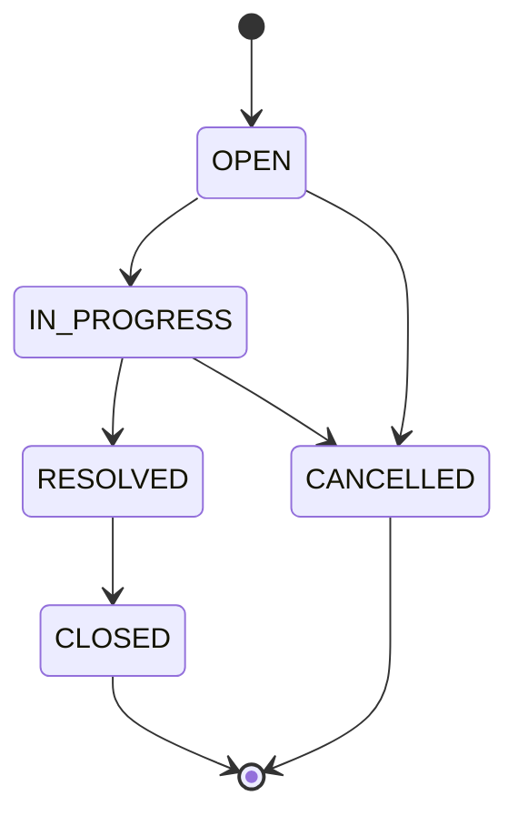

# Support Ticket Management System — Status State Machine

## 1. Purpose

This document is the authoritative specification for ticket status transitions. The backend must reject every transition not listed in §3 with **HTTP 409 Conflict**.

**Related specifications:**

- [data-model.md](./data-model.md) — `status` field definition
- [api-contract.md](./api-contract.md) — `PATCH /api/tickets/{id}/status`
- [architecture.md](./architecture.md) — `StatusTransitionValidator` in service layer
- [ui-flow.md](./ui-flow.md) — legal transition controls in the UI

---

## 2. States

| Status | Description | Terminal |
|--------|-------------|----------|
| `OPEN` | Newly created; not yet being worked | no |
| `IN_PROGRESS` | Actively being worked | no |
| `RESOLVED` | Fix/work complete; awaiting closure | no |
| `CLOSED` | Successfully completed | **yes** |
| `CANCELLED` | Withdrawn or abandoned | **yes** |

**Initial state:** Every new ticket is created with status `OPEN`.

**Terminal states:** `CLOSED` and `CANCELLED` — no further transitions are permitted.

---

## 3. Allowed Transitions

Exactly **five** transitions are valid:

| # | From | To | Typical meaning |
|---|------|----|-----------------|
| 1 | `OPEN` | `IN_PROGRESS` | Work started |
| 2 | `OPEN` | `CANCELLED` | Ticket withdrawn before work began |
| 3 | `IN_PROGRESS` | `RESOLVED` | Work finished |
| 4 | `IN_PROGRESS` | `CANCELLED` | Ticket abandoned during work |
| 5 | `RESOLVED` | `CLOSED` | Resolution confirmed; ticket closed |



---

## 4. Disallowed Transitions

**All transitions not listed in §3 are invalid** and must be rejected with **HTTP 409**.

### 4.1 Explicitly disallowed examples

| From | To | Reason |
|------|----|--------|
| `OPEN` | `RESOLVED` | Must pass through `IN_PROGRESS` |
| `OPEN` | `CLOSED` | Must pass through `IN_PROGRESS` → `RESOLVED` |
| `IN_PROGRESS` | `OPEN` | No backward transition |
| `IN_PROGRESS` | `CLOSED` | Must pass through `RESOLVED` |
| `RESOLVED` | `OPEN` | No backward transition |
| `RESOLVED` | `IN_PROGRESS` | No backward transition |
| `RESOLVED` | `CANCELLED` | Cannot cancel after resolution |
| `CLOSED` | *any* | Terminal state |
| `CANCELLED` | *any* | Terminal state |
| *any* | *same* | No-op transitions are invalid (e.g. `OPEN` → `OPEN`) |

### 4.2 HTTP response for invalid transition

**Status code:** `409 Conflict`

**Response body:** Standard `ErrorResponse` (see [api-contract.md](./api-contract.md))

```json
{
  "timestamp": "2026-09-11T12:00:00Z",
  "status": 409,
  "error": "Conflict",
  "message": "Invalid status transition from OPEN to RESOLVED",
  "path": "/api/tickets/3fa85f64-5717-4562-b3fc-2c963f66afa6/status",
  "fieldErrors": []
}
```

The `message` must include both the **current** and **requested** status values.

---

## 5. Enforcement Rules

### 5.1 Where enforced

| Layer | Enforces? |
|-------|-----------|
| Service (`StatusTransitionValidator`) | **Yes** — single source of truth |
| Controller | No — delegates to service |
| Repository / entity | No |
| Database | No CHECK constraint required for v1 |

### 5.2 How status may change

| Endpoint | May change `status`? |
|----------|----------------------|
| `POST /api/tickets` | No — always creates as `OPEN`; ignore any client-supplied status |
| `PATCH /api/tickets/{id}` | **No** — status field is not accepted on this endpoint |
| `PATCH /api/tickets/{id}/status` | **Yes** — only path to change status |

Attempting to include `status` in create or update request bodies must result in **HTTP 400** (unrecognized field ignored by Jackson is acceptable; if accepted, must still be rejected explicitly).

### 5.3 Transition algorithm

```
1. Load ticket by id → 404 if not found
2. Let current = ticket.status, target = request.status
3. If current == target → reject 409 (no self-transition)
4. If current is CLOSED or CANCELLED → reject 409
5. If target not in ALLOWED[current] → reject 409
6. Set ticket.status = target, refresh updatedAt, persist → return 200
```

### 5.4 Allowed-transition lookup table

```text
ALLOWED = {
  OPEN:          { IN_PROGRESS, CANCELLED }
  IN_PROGRESS:   { RESOLVED, CANCELLED }
  RESOLVED:      { CLOSED }
  CLOSED:        { }
  CANCELLED:     { }
}
```

---

## 6. Legal Next States (UI reference)

The UI uses this table to show only valid action buttons. The backend remains authoritative.

| Current status | Actions shown |
|----------------|-----------------|
| `OPEN` | → `IN_PROGRESS`, → `CANCELLED` |
| `IN_PROGRESS` | → `RESOLVED`, → `CANCELLED` |
| `RESOLVED` | → `CLOSED` |
| `CLOSED` | *(none)* |
| `CANCELLED` | *(none)* |

---

## 7. Test Matrix

Every cell: **allowed** = expect success (200); **denied** = expect 409.

| From \ To | OPEN | IN_PROGRESS | RESOLVED | CLOSED | CANCELLED |
|-----------|------|-------------|----------|--------|-----------|
| **OPEN** | denied | allowed | denied | denied | allowed |
| **IN_PROGRESS** | denied | denied | allowed | denied | allowed |
| **RESOLVED** | denied | denied | denied | allowed | denied |
| **CLOSED** | denied | denied | denied | denied | denied |
| **CANCELLED** | denied | denied | denied | denied | denied |

---

## 8. Document History

| Version | Date | Changes |
|---------|------|---------|
| 1.0 | 2026-09-11 | Initial state machine spec |
