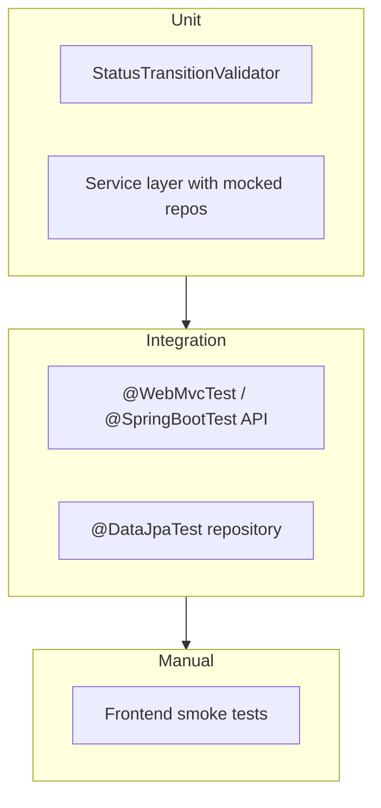

# Support Ticket Management System — Test Strategy

## 1. Purpose

This document defines the testing approach for the Support Ticket Management System. Tests verify behavior against [requirements.md](./requirements.md), [api-contract.md](./api-contract.md), [data-model.md](./data-model.md), and [state-machine.md](./state-machine.md).

**Goal:** High confidence in business rules (especially status transitions and validation boundaries) with a pragmatic test pyramid suitable for a senior engineer assignment.

---

## 2. Test Pyramid



| Layer | Scope | Tools | Speed |
|-------|-------|-------|-------|
| Unit | Pure logic, services with mocks | JUnit 5, Mockito | Fast |
| Integration | Repositories, HTTP API, DB | Spring Boot Test, H2 test DB | Medium |
| Manual | End-to-end UI flows | Browser, dev servers | Slow |

**Target:** Majority of tests at unit + integration layers; manual smoke as a release checklist.

---

## 3. Test Environment

### 3.1 Backend

| Setting | Value |
|---------|-------|
| Test database | H2 in-memory (`jdbc:h2:mem:testdb`) for integration tests |
| Profile | `test` (separate from default and `postgres`) |
| PostgreSQL | Optional: Testcontainers for profile parity (not required for assignment minimum) |

### 3.2 Frontend

| Setting | Value |
|---------|-------|
| API mocking | Optional MSW or Vitest mocks for component tests |
| E2E | Manual smoke only (no Playwright/Cypress required for v1) |

---

## 4. Unit Tests

### 4.1 StatusTransitionValidator

**Priority: critical** — pure unit tests, no Spring context.

| Test case | Expected |
|-----------|----------|
| `OPEN` → `IN_PROGRESS` | allowed |
| `OPEN` → `CANCELLED` | allowed |
| `IN_PROGRESS` → `RESOLVED` | allowed |
| `IN_PROGRESS` → `CANCELLED` | allowed |
| `RESOLVED` → `CLOSED` | allowed |
| `OPEN` → `RESOLVED` | rejected |
| `OPEN` → `CLOSED` | rejected |
| `IN_PROGRESS` → `OPEN` | rejected |
| `RESOLVED` → `OPEN` | rejected |
| `CLOSED` → `IN_PROGRESS` | rejected |
| `CANCELLED` → `OPEN` | rejected |
| `OPEN` → `OPEN` (same state) | rejected |
| All terminal-state transitions | rejected |

Cover full matrix from [state-machine.md](./state-machine.md) §7.

### 4.2 TicketService (mocked repositories)

Use `@ExtendWith(MockitoExtension.class)`; mock `TicketRepository`, `CommentRepository`, `StatusTransitionValidator`.

| Area | Tests |
|------|-------|
| Create | Sets status `OPEN`; maps DTO → entity; returns detail DTO |
| Create | Trims string fields; null assignee when blank |
| Update | Updates fields; refreshes `updatedAt`; does not change status |
| Update | Throws not-found when id missing |
| Transition | Calls validator; persists new status on success |
| Transition | Propagates `InvalidStatusTransitionException` on rejection |
| FindAll | Delegates search/filter params to repository |
| FindById | Throws not-found when missing |

### 4.3 CommentService (mocked repositories)

| Area | Tests |
|------|-------|
| Add comment | Verifies ticket exists before save |
| Add comment | Throws not-found for missing ticket id |
| Add comment | Returns comment DTO with correct `ticketId` |

---

## 5. Validation Boundary Tests

Test via `@WebMvcTest` controller tests or full `@SpringBootTest` API tests. Assert **HTTP 400** and `fieldErrors` structure.

### 5.1 Ticket title (`POST` / `PATCH`)

| Input | Expected |
|-------|----------|
| missing / blank | 400, field `title` |
| 2 chars | 400 (below min 3) |
| 3 chars | 201/200 success |
| 120 chars | success |
| 121 chars | 400 (above max) |

### 5.2 Ticket description

| Input | Expected |
|-------|----------|
| missing / blank | 400 |
| 4 chars | 400 (below min 5) |
| 5 chars | success |
| 5000 chars | success |
| 5001 chars | 400 |

### 5.3 Assignee (optional)

| Input | Expected |
|-------|----------|
| omitted | success, null assignee |
| `""` | success, null assignee |
| 120 chars | success |
| 121 chars | 400 |

### 5.4 Priority

| Input | Expected |
|-------|----------|
| missing | 400 |
| `"URGENT"` (invalid) | 400 |
| each valid enum | success |

### 5.5 Comment fields (`POST .../comments`)

| Input | Expected |
|-------|----------|
| author missing / blank | 400 |
| author 121 chars | 400 |
| body missing / blank | 400 |
| body 2000 chars | success |
| body 2001 chars | 400 |

### 5.6 Malformed requests

| Input | Expected |
|-------|----------|
| Invalid JSON body | 400 |
| Invalid UUID in path | 400 |
| Invalid `status` query param on list | 400 |

---

## 6. State Machine Integration Tests

`@SpringBootTest` + `@AutoConfigureMockMvc` (or `@WebMvcTest` with mocked service — prefer full stack for confidence).

### 6.1 Happy-path lifecycle

```
POST ticket → OPEN
PATCH status IN_PROGRESS → 200
PATCH status RESOLVED → 200
PATCH status CLOSED → 200
```

### 6.2 Cancel paths

```
POST ticket → OPEN
PATCH status CANCELLED → 200

POST ticket → OPEN → IN_PROGRESS
PATCH status CANCELLED → 200
```

### 6.3 Rejection paths (all expect 409)

| Sequence | Invalid step |
|----------|--------------|
| OPEN → RESOLVED | direct skip |
| OPEN → CLOSED | direct skip |
| IN_PROGRESS → OPEN | backward |
| RESOLVED → CANCELLED | illegal |
| CLOSED → IN_PROGRESS | terminal |
| CANCELLED → OPEN | terminal |
| OPEN → OPEN | self-transition |

### 6.4 Status not mutable via PATCH ticket

```
POST ticket (OPEN)
PATCH /api/tickets/{id} with only field updates → status still OPEN
```

Verify status cannot be changed through the general update endpoint.

---

## 7. Comment Tests

### 7.1 Integration (API + DB)

| Test | Expected |
|------|----------|
| Add comment to existing ticket | 201; comment persisted |
| Get ticket detail after comment | comment in `comments` array |
| Add comment to non-existent ticket | 404 |
| Multiple comments | ordered by `createdAt` ASC |
| Comment survives restart | persistence test (H2 file or in-memory re-init with same DB) |

### 7.2 API contract

| Test | Expected |
|------|----------|
| Response includes `id`, `ticketId`, `author`, `body`, `createdAt` | all present |
| `ticketId` matches path param | correct FK |

---

## 8. Search & Filter Tests

Repository-level (`@DataJpaTest`) and API-level tests.

### 8.1 Repository / service

Seed tickets with varied title, description, status.

| Scenario | Expected results |
|----------|------------------|
| No filters | all tickets |
| `q` matches title (mixed case) | matching tickets only |
| `q` matches description only | matching tickets only |
| `q` matches both title and description on same ticket | ticket appears once |
| `q` no match | empty list |
| `q` blank / whitespace | all tickets (no text filter) |
| `status=OPEN` | only OPEN tickets |
| `q` + `status` combined | AND semantics |
| Invalid status enum | 400 at API layer |

### 8.2 API

```
GET /api/tickets?q=password&status=OPEN
```

Assert JSON array length and field presence per `TicketSummary` schema.

---

## 9. Repository Integration Tests

`@DataJpaTest` with H2.

| Repository | Tests |
|------------|-------|
| `TicketRepository` | save and find by UUID |
| `TicketRepository` | `findAllByFilters` with status only |
| `TicketRepository` | `findAllByFilters` with keyword only |
| `TicketRepository` | `findAllByFilters` with both |
| `TicketRepository` | `findByIdWithComments` loads comments |
| `CommentRepository` | save with FK to ticket |
| `CommentRepository` | FK violation when ticket missing |

---

## 10. API Integration Tests

`@SpringBootTest(webEnvironment = RANDOM_PORT)` or `@AutoConfigureMockMvc`.

| Endpoint | Key tests |
|----------|-----------|
| `POST /api/tickets` | 201 + response shape; 400 validation |
| `GET /api/tickets` | 200 array; empty array; search/filter |
| `GET /api/tickets/{id}` | 200 detail with comments; 404 |
| `PATCH /api/tickets/{id}` | 200 update; 404; 400 validation |
| `PATCH /api/tickets/{id}/status` | 200 legal; 409 illegal |
| `POST /api/tickets/{id}/comments` | 201; 404; 400 |

### 10.1 Error response shape

For 400, 404, 409 responses assert:

- `timestamp`, `status`, `error`, `message`, `path` present
- `fieldErrors` is array (may be empty)
- HTTP status matches body `status`
- No stack trace in body

### 10.2 Persistence

| Test | Steps |
|------|-------|
| Ticket survives context restart | create → restart test context or new connection → GET still returns ticket |
| Updated fields persisted | PATCH → GET reflects changes |

---

## 11. Controller Tests (optional lightweight)

`@WebMvcTest(TicketController.class)` with mocked services for:

- Correct HTTP method and path mapping
- `@Valid` triggers 400 on invalid body
- 201/200 status codes on success

Use when full integration tests are slow; not a substitute for state machine integration tests.

---

## 12. Manual Frontend Smoke Tests

Execute with backend (`:8080`) and frontend (`:5173`) running locally. Checklist:

### 12.1 Dashboard

- [ ] Page loads; tickets displayed
- [ ] Empty state when no tickets
- [ ] Search by keyword narrows results
- [ ] Status filter narrows results
- [ ] Search + filter combined works
- [ ] Click row opens detail page
- [ ] Loading spinner shown during fetch
- [ ] Network error shows readable banner

### 12.2 Create ticket

- [ ] Form validation prevents submit with invalid lengths
- [ ] Successful create navigates to detail
- [ ] API validation errors shown inline

### 12.3 Ticket detail

- [ ] All fields and comments displayed
- [ ] 404 page for invalid UUID / missing ticket
- [ ] Edit saves changes
- [ ] Edit validation errors shown inline

### 12.4 Status transitions

- [ ] Only legal buttons shown per current status
- [ ] Successful transition updates badge
- [ ] Illegal transition (if forced via dev tools) shows 409 message
- [ ] Terminal states hide action buttons

### 12.5 Comments

- [ ] Add comment appears in list
- [ ] Validation errors on empty author/body
- [ ] Form clears on success

---

## 13. Coverage Expectations

| Area | Minimum expectation |
|------|---------------------|
| `StatusTransitionValidator` | 100% branch coverage |
| Service layer | All public methods; happy + error paths |
| Status transitions (API) | All 5 allowed + representative 409 cases |
| Validation boundaries | Min/max length for every constrained field |
| Search/filter | At least one test per parameter combination |
| Comments | Create, list on detail, 404, validation |
| Manual smoke | Full checklist pass before submission |

---

## 14. CI Recommendations

```text
backend:  ./mvnw test          # unit + integration
frontend: npm run build        # compile check (no test required for v1 unless added)
```

Optional: GitHub Actions running `mvn test` on every push.

---

## 15. Out of Scope (v1)

- Performance/load testing
- Security/penetration testing
- Automated browser E2E (Playwright/Cypress)
- PostgreSQL Testcontainers (optional stretch goal)
- Contract testing (Pact)

---

## 16. Document History

| Version | Date | Changes |
|---------|------|---------|
| 1.0 | 2026-09-11 | Initial test strategy |
